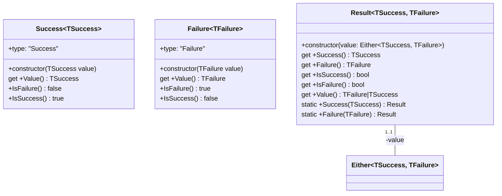
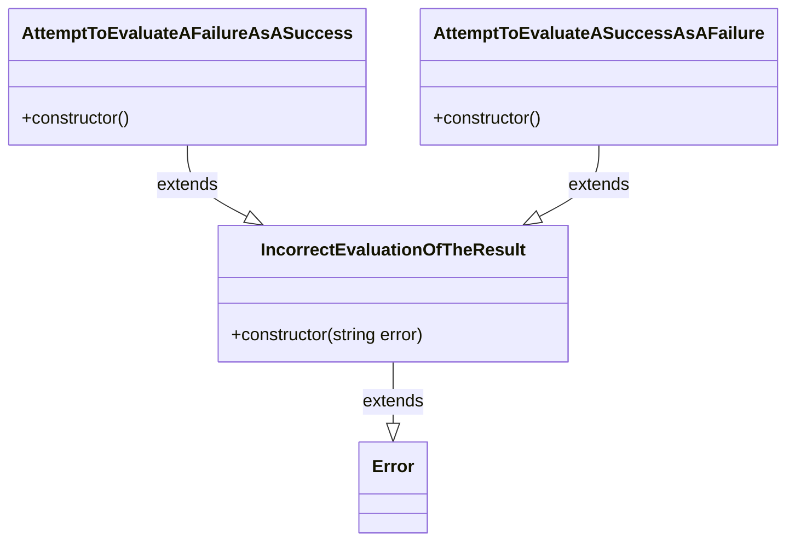

# ts-expressive-result

The `ts-expressive-result` library provides a straightforward and elegant approach for TypeScript developers to manage successes and errors in their codebase. Inspired by patterns found in languages like Java, this library is designed to enhance expressiveness, particularly in scenarios requiring rich domain modeling, such as Domain-Driven Design (DDD). By explicitly defining expected errors, it forces developers to handle these scenarios meticulously, thereby significantly enhancing the readability and robustness of the code.

## Features

-   **Strong Type Support**: Leverage TypeScript's type system for better compile-time checks.
-   **Expressive Error Handling**: Easily differentiate between success and failure outcomes in your functions.

## Installation

Install the package via npm:

```npm install --save-dev ts-expressive-result```

## Usage

### Example 1: Handling Division Operations

This example showcases how to deal with expected errors in your code such as here, with the divide function which can not manage the division by 0 but return an error.

```typescript
import { Result } from 'ts-expressive-result';

class CanNotDivideByZero extends Error {
    public constructor() {
        super("Cannot divide by zero.");
    }
}

function Division(dividend: number, divisor: number): Result<number, CanNotDivideByZero> {
    if (divisor === 0)
        return Result.Failure(new CanNotDivideByZero());
        
    return Result.Success(dividend / divisor);
}

// Example usage
const divisionBy0 = Division(10, 0);
console.log(divisionBy0.Value); // [Error: Cannot divide by zero.]
console.log(divisionBy0.IsSuccess); // false
console.log(divisionBy0.IsFailure); // true
if (divisionBy0.IsFailure)
    console.log(divisionBy0.Failure.message); // Cannot divide by zero.

const divisionBy10 = Division(10, 10);
console.log(divisionBy10.Value); // 1
console.log(divisionBy10.IsSuccess); // true
console.log(divisionBy10.IsFailure); // false
```

### Example 2: Validating Fibonacci Sequence Input

This example showcases how to enforce business rules whereas the Fibonacci function has an arbitrary limit you must not exceed.

```typescript
import { Result } from 'ts-expressive-result';

class ValueCanNotExceedTheLimit extends Error {
    public constructor(limit: number) {
        super(`Value cannot exceed the limit of ${limit}.`);
    }
}

function FibonacciLogic(value: number): number {
    if (value <= 1)
	    return value;
	    
    return FibonacciLogic(value - 1) + FibonacciLogic(value - 2);
}

function Fibonacci(value: number): Result<number, ValueCanNotExceedTheLimit> {
    const limit = 20;
    
    if (value > limit)
        return Result.Failure(new ValueCanNotExceedTheLimit(limit));
        
    return Result.Success(FibonacciLogic(value));
}

// Example usage
const fib20 = Fibonacci(20);
console.log(fib20); // Result { value: Success { type: "Success", value: 6765 } }
console.log(fib20.Value); // 6765
console.log(fib20.IsSuccess); // true
console.log(fib20.IsFailure); // false

const fib21 = Fibonacci(21);
console.log(fib21); // Result { value: Failure { Value: [Error: Value cannot exceed the limit of 20.] } }
console.log(fib21.Value); // [Error: Value cannot exceed the limit of 20.]
console.log(fib21.IsSuccess); // false
console.log(fib21.IsFailure); // true

const fib21Failure = fib21.Failure;
console.log(fib21Failure); // [Error: Value cannot exceed the limit of 20.]
console.log(fib21.Success); // Throws IncorrectEvaluationOfTheResult: Attempt to evaluate a failure as a success.
```

## UML Conception





## Contributing

Any contributions you make are **greatly appreciated**.

## License

Distributed under the MIT License. See `LICENSE` for more information.